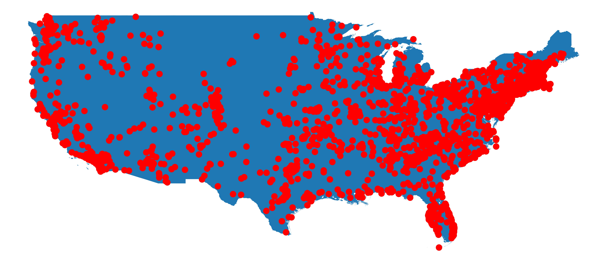

# ufo-from-vector-space
Data and analysis of UFO sightings in the USA.



## Project structure
```bash
.
├── config                      
│   └── configurations.ini
├── data            
│   ├── final      
│   ├── maps
│   │   └── dissolved_us 
│   ├── processed                   
│   └── raw
├── docs 
├── environment.sh
├── .gitignore
├── notebooks
├── README.md
├── src
│   ├── __init__.py 
│   ├── clean_data.py
│   ├── config.py
│   ├── get_data.py
│   ├── plot_map.py
│   └── UFO.py
└── tests
    └── __init__.py 
```

